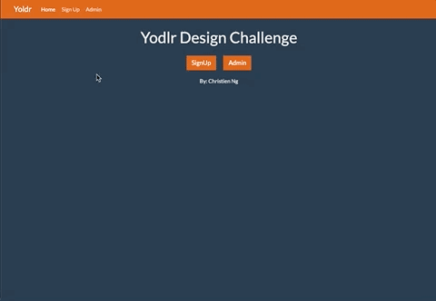

# Yodlr Frontend Challenge

## See [Prompt](/prompt.md)

##### Demo

## **How to Run**

    $ git clone https://github.com/cng008/yodlr-take-home.git
    $ npm i
    $ npm start

## **Technologies**

This project was made using the following technologies:

- [Javascript](https://www.javascript.com)
- [jQuery](https://jquery.com)
- [Axios](https://axios-http.com/docs/intro)
- [HTML](https://developer.mozilla.org/en-US/docs/Web/HTML)
- [Bootstrap 5](https://getbootstrap.com/docs/5.1/getting-started/introduction/)
- [VSCode](https://code.visualstudio.com/docs)
